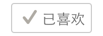

ButtonIndicatorView
================
Button with indicator when doing some action(passed as block), often used as LikeButton




Installation
-------------------------
- Grab the source file into your project. 
- Or use cocoapods. Here is an example of your podfile:

```
pod 'ButtonIndicatorView'
```

Usage
-------
####Basic Usage
```
ButtonIndicatorView *buttonIndicatorView = [[ButtonIndicatorView alloc] initWithFrame:frame likeBlock:likeBlock unLikeBlock:unLikeBlock];
```
And Implement your like and unlike action block according to your requirement.

####Customize your ButtonIndicatorView:
Inherit from ButtonIndicatorView, and implement the subclass method to customize your button style:

```
- (void)updateButtonStyleLiked:(BOOL)isLiked
{
  if (isLiked) {
    // liked style
  } else {
    // not liked style
  }
}
```
See LikeButtonIndicatorView as example:

License
------
ButtonIndicatorView is available under the MIT license. See the LICENSE file for more info.
